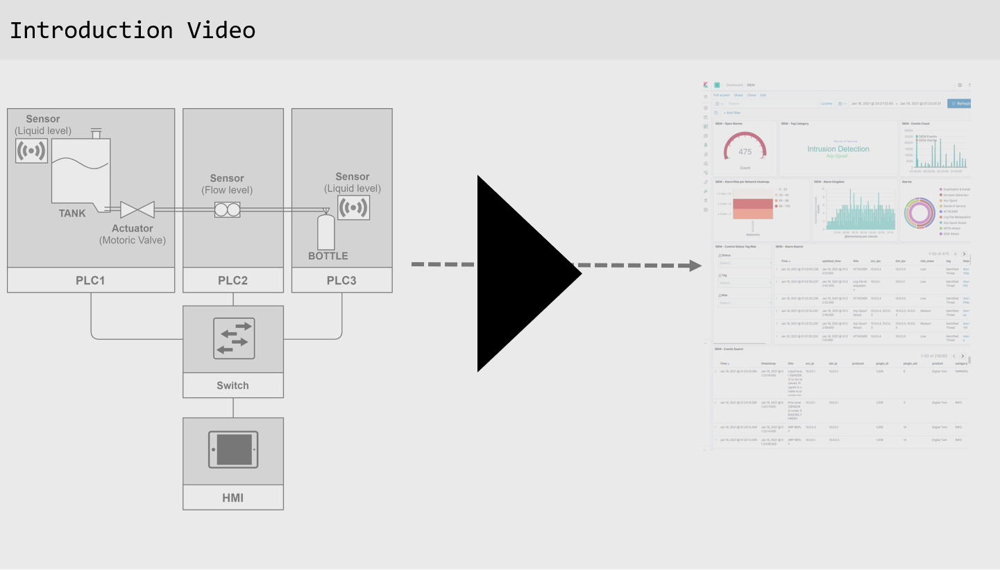
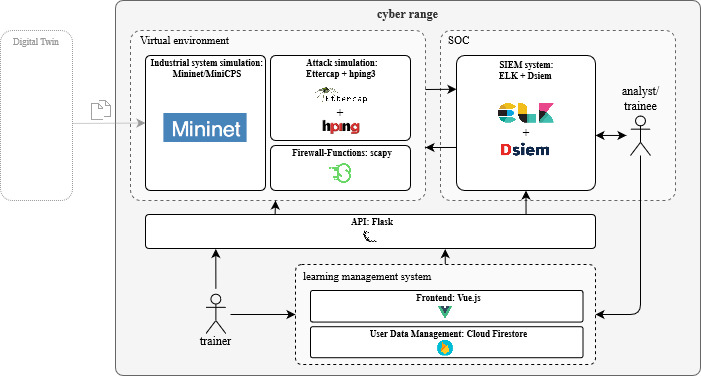
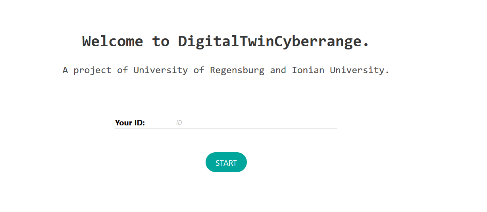
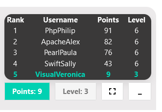

# DigitalTwinCyberrange
**DigitalTwinSocCyberrange** is a research project by the University of Regensburg and the Ionian University. This prototype aims to provide training for SOC analysts in a highly realisitic environment making use of the simulation component of the digital twin of an industrial filling plant. The concept was evaluated in an extensive user study. The results of the user study are presented in the [userStudy repository](https://github.com/DigitalTwinSocCyberrange/userStudy). The following video gives an introduction to the project and the learning concept of the cyber range.

<p align="center">
<a href="http://www.youtube.com/watch?feature=player_embedded&v=6czq4r2_kTk
" target="_blank"></a> </p> 

## Architecture of the prototype
- The **Virtual Environment** consists of the simulation component of a Digital Twin which is tailored to the needs of the cyber range scenario. It is implemented with [MiniCPS](https://github.com/scy-phy/minicps), an academic framework for simulating cyber-physical systems which builds upon [Mininet](http://mininet.org). The simualted attacks are performed with [Ettercap](https://www.ettercap-project.org/) and [hping](http://www.hping.org/). The firewall functionalities are implemeted with [Scapy](https://scapy.net/).
- The **SIEM** system is realized with [Dsiem](https://www.dsiem.org/), which builds upon [Filebeat, Elasticsearch, Logstash and Kibana](https://www.elastic.co/).
 
The Digital Twin Simulation and the SIEM system of the prototype is based on a microservice architecture consisting of **Docker Containers**. 

- The **Learning Management System (LMS)** is implemented with the JavaScript Framework [Vue.js](https://vuejs.org/). The respective source code is stored in the [frontendCyberrange](https://github.com/DigitalTwinSocCyberrange/frontendCyberrange) repository of the project.
- The Digital Twin Simulation, the SIEM-System and the LMS are connected with an **[REST-API]((https://github.com/DigitalTwinSocCyberrange/DigitalTwinCyberrange/tree/main/src/pyrest))** implemented with [Flask](https://flask.palletsprojects.com/en/1.1.x/)
- The user data is stored in a Firestore collection, described in detail [here](#user-data-management)

 <p align="center">
  
</p>


## Installation (for Ubuntu 20.04)

- Install Docker-Compose as described here: https://docs.docker.com/compose/install/
- Clone the required repositories:
```bash
git clone git@github.com:DigitalTwinSocCyberrange/DigitalTwinCyberrange.git && \
git clone git@github.com:DigitalTwinSocCyberrange/frontendCyberrange.git
 ```
 - **Install dependencies for deployment of the frontend:**
```bash
cd frontendCyberrange && \
bash setup_frontend.sh
 ```

- **Install dependencies for deployment of the Flask-Api:**
```bash
cd DigitalTwinCyberrange && \
bash setup_python.sh
 ```
- **Setup and start the cyber range**: This will start the microservice-infrastructure (Elasticsearch, Filebeat, Logstash, Kibana, Dsiem and Digital Twin), the cyber range frontend (running on port 7080) and the API that connects both
```bash
cd deployments/docker && \
bash init_cyberrange.sh
 ```
- Enter the ip address or hostname where the cyberrange should be deployed. Usually this is either the default ip address of the maschine or localhost. 199.999.9.99 is used as an example ip address here.

```bash
Enter the Hostname or IP Address where the cyber range will be deployed: 199.999.9.99
```
 - Access the cyber range on port 7080: **ht<span>tp://</span>199.999.9.99:7080**, to get an idea of the prototype, you can use the demo user (without user data management) **ID=127**
 <p align="center">
  
</p>

 - If you want to conduct a cyber range training with multiple participants and use the scoreboard, please proceed with [User Data Management](#user-data-management)
## Shutdown
To shut down the infrastructure you can either the use the API-functionality **ht<span>tp://</span>199.999.9.99:9090/stop_cr** or run the shutdown script:
 
 ```bash
cd deployments/docker && \
bash docker_stop.sh
 ```

## Startup
To restart the infrastructure you can either the use the API-functionality **ht<span>tp://</span>199.999.9.99:9090/start_cr** or run the startup script:
 
 ```bash
cd deployments/docker && \
bash start_docker_api.sh
 ```
 


## User Data Management
User data management enables the gamification aspect of the cyber range with a score board displaying the scores of the other players in order motivate the trainees to engage well in the training. 
 <p align="center">
  
</p>
Furthermore, storing the progress of each user in a central database enables the trainer to monitor the conduction of the training and facilitates to evaluate the training after conduction. 
Every trainee is assigned the following attributes.

 - ID
 - username
 - round
 
(E.g. ID: 5328, userName: VisualVeronica, round: 1). **ID** is randomly chosen and used to log into the cyber range, whilst the **username** will be displayed on the scoreboard. **Round** refers to the round of conduction of the cyber range training. The trainee will only see the scores of the players that are playing in the same round as he or she does.


### Create Firestore Collection
- Within a Firebase project create **Firestore collection named "cyberrangeDashboard"** as described [here](https://firebase.google.com/docs/firestore/quickstart)
- To link the cyber range to your collection copy the **firebaseConfig** object from the firebase console (Settings -> General) as described [here](https://firebase.google.com/docs/web/setup#config-object) and add it to the configruation file [firebase.js](https://github.com/DigitalTwinSocCyberrange/frontendCyberrange/blob/main/src/firebase.js)
### Create usernames and IDs
- username/ID combination
- add IDs to the frontend in [usernames.js](https://github.com/DigitalTwinSocCyberrange/frontendCyberrange/blob/main/src/data/usernames.js)
- Now either add the user data manually to the Firestore collection or use the python scripts described in the next section to import user data from a csv file to the Firestore collection

### Import and export of user data with .csv files
- upload csv with ID, username and round to Firestore
- create a Service Account on Firebase. This can be done on the Firebase Dashboard via Settings -> Service Account -> "Generate Private Key" as described [here]( https://firebase.google.com/docs/admin/setup#python)
- Replace the file [serviceAccount.json](https://github.com/DigitalTwinSocCyberrange/frontendCyberrange/blob/main/FirebaseScripts/serviceAccount.json) with your created key (also naming it serviceAccount.json)
- export user data similar to that
